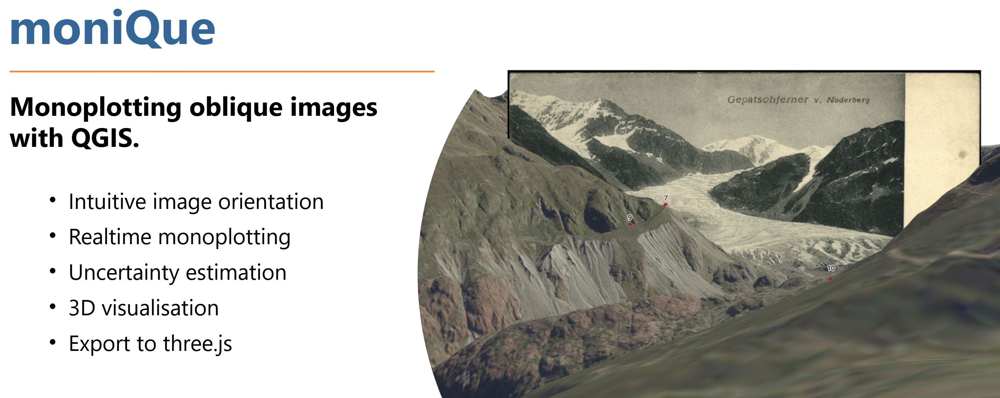
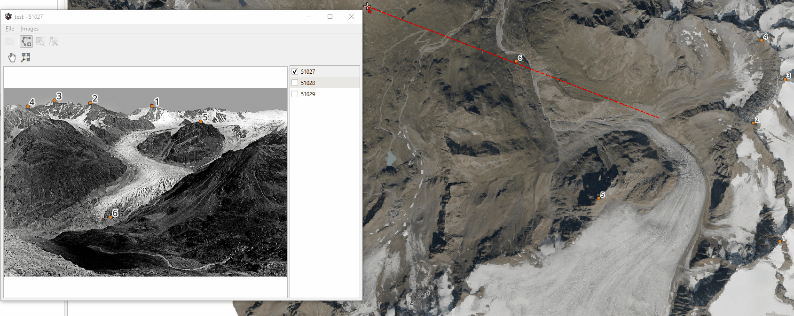

## Supported QGIS versions
We tested moniQue with the following QGIS versions:
| Version  | OS | Python |
| --- | --- | --- |
| 3.34.3 | Windows | Python 3.11
| 3.34.15 (LTR) | Windows | Python 3.12
| 3.34.40 | Windows | Python 3.12

## Installation
### Required Python packages
Open the **OSGeo4W Shell** and install the required python packages using pip  

    pip install --user open3d pygfx glfw lmfit

`open3d` is required for raycasting, `pygfx` and `glfw` for rendering the terrain in 3D, `lmfit` for the least squares spatial resection and `pymartini` for the simplifcation of the initial digital terrain model (DTM). Installation with the `--user` option is necessary as the default QGIS Python interpreter is located on ```C:\...``` which would require admin rights.  

### Plugin
After installing the additional Python packages, **moniQue** can be installed like any other QGIS plugin from `Plugins -> Manage plugins`. After the succesful installation you should see the logo in the QGIS main toolbar and a new entry in the `Plugin` menu is available.

## Usage
### Mesh generation
moniQue requires a digital terrain model (DTM) as mesh in the PLY format. We recommened to use XYZ to generate not only the mesh but also all necessary auxilliary files. 

<!-- ### Terrain simplification
For the rendering of the terrain in 3D and raycasting we represent the terrain as mesh. If you already have a DTM as mesh, specifically in the .ply format, you can directly use it and skip this step. Otherwise moniQque offers the functionality to convert an existing DTM, available as grid (.tif) to a simplified mesh (.ply). Go to `Plugins -> moniQue -> Convert DTM to mesh` which opens a new dialog. From the new dialog select the input grid, output path and the maximum error of the simplified mesh. -->

### Creating a new project
To create a new project select `File -> New Project` in the moniQue main window. In the new dialog you need to specify where the new project shall be saved (GPKG Path), the path to the `tiles.json` created prior with XYZ and the coordinate system. The selected coordinate system must be the same as for the mesh. 

### Importing images
Images can be imported through `Images -> Import images`. The names of the images must be unique. It is recommened that the image names do not contain special characters (&,ä,ö,...) or white spaces. To display an image in the image canvas (left) it has to be selected from the image list (right).

### Image orientation
We estimate the unknown camera parameters (exterior and interior orientation) by spatial resection. As we assume 7 parameters to be unknown (coordinates of the projection center, euler angles, focal length) we need at least 4 ground control points (GCPs) for the calculation. To open the spatial resection dialog click on the camera icon the in toolbar of the main dialog. As long as this dialog is open it is possible to select GCPs both in the image and object space. Both in the image canvas and 3D canvas a new GCP can be added by clicking `Ctrl + Left Mouse Button`. This will open a new dialog where the ID of the GCP can be set. The image and object coordinates of GCPs are linked by their ID. Hence, if you give an image GCP and object GCP the same ID than they will be treated together as one GCP. 

Before we can calculate the camera parameters we need initial estimates for the unknown paramters. One of the advantadges display the terrain in 3D is that we can use the 3D viewer for obtaining those values. Hence, align the camera of the 3D viewer in such a way that it resembles the historical image. If your satisfied you can select the underlying camera paramters by clicking on the icon above the camera paramters. In this way moniQue automatically extracts the required values from the 3D camera. If you have added at least 4 GCOs and set the intitial camera parameters you can now calculate the spatial resection be clicking the `Calculate` button. If the calculation was successful the 3D camera is automatically set to the calculated camera parameters. Furthermore, within the spatial resection dialog you will se values for the image residuals in the GCP table. Furthremore, as we are using least squares for the calculation, we also obtain accuracy measures for the estimated camera parameters. If your satisfied with the result, click `Save` which will save the estimated camera parameters and GCP configuration to the project file.

### Monoplotting
After we estimated the camera parameters we now can intersect image rays defined by the projection center through image pixels with the terrain. This allows us to obtain object coordinates of the image pixels and hence, directly document features of interest in the image. This is called monoplotting:

To activate monoplotting click the icon next to the camera symbol in the main dialog. If you now move your mouse over the image canvas, moniQue automatically intersects the respective image rays with the terrain mesh. As a result you see the intersection point in the QGIS main canvas. By clicking the left mouse button vertices of a polyline are created and stored. You can finish a polyline by clicking the right mouse button.

### Visualisation
## Local server
`python3 -m http.server -d path/to/files 8000`

## Funding
moniQue was developed within the SEHAG project which was funded by the DFG (Deutsche Forschungsgemeinschaft) under the grant [FOR 2793](https://gepris.dfg.de/gepris/projekt/394200609) and FWF (Österreichischer Wissenschaftsfond) under the grant [I 4062](https://www.fwf.ac.at/forschungsradar/10.55776/I4062).

## Contact
Sebastian Mikolka-Flöry (sebastian.floery@geo.tuwien.ac.at)

## References
