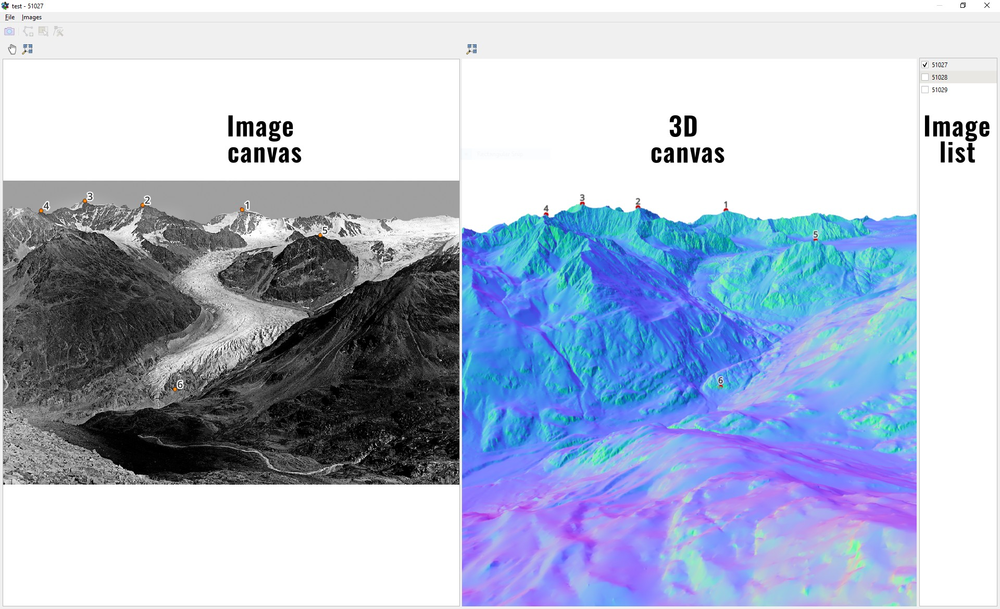

# moniQue

## Installation
### Additional Python packages
Open the OSGeo4W Shell and install From the OSGeo4W Shell install required python packages using pip  

    pip install --user open3d pygfx lmfit pymartini

`open3d` is required for raycasting, `pygfx` for rendering the terrain in 3D, `lmfit` for the least squares spatial resection `pymartini` for the simplifcation of the initial digital terrain model (DTM). Installation with the `--user` option is required as the default QGIS Python Interpreter is located on C:\ which would require admin rights.  

### moniQue
After installing the additional Python packages, moniQue can be installed as any QGIS plugin from `Plugins -> Manage plugins`. After the succesful installation you should see the logo in the QGIS main toolbar and a new entry in the `Plugin` menu is available.

## Usage
### Terrain simplification
For the rendering of the terrain in 3D and raycasting we represent the terrain as mesh. If you already have a DTM as mesh, specifically in the .ply format, you can directly use it and skip this step. Otherwise moniQque offers the functionality to convert an existing DTM, available as grid (.tif) to a simplified mesh (.ply). Go to `Plugins -> moniQue -> Convert DTM to mesh` which opens a new dialog. From the new dialog select the input grid, output path and the maximum error of the simplified mesh.

### Create new project
You can start the main dialog of moniQue either by clicking the logo in the main toolbar or through the Plugin menu. Either way, a new monoplotting project can be created from the main dialog through `File -> New Project`. In the new dialog you need to specify the path to the project file which will be created (GPKG Path), to the mesh (Mesh Path) and specify the coordinate system. The selected coordinates system must be the same CRS used for the mesh. After you set all options you can create a new project by clicking `Create`. As soon as all files are created and loaded, you will see the 3D terrain model in the 3D viewer.

### Import images
To add images to the project select `Images -> Import images`. Make sure that the names of the images you import are unique as those are used as unique ids throughout the whole project. After importing the images you can show the images by clicking on their name in the image list. Now your ready to estimate the interior and exterior orientation of the imported images and use them for monoplotting.

### Spatial resection

### Monoplotting
